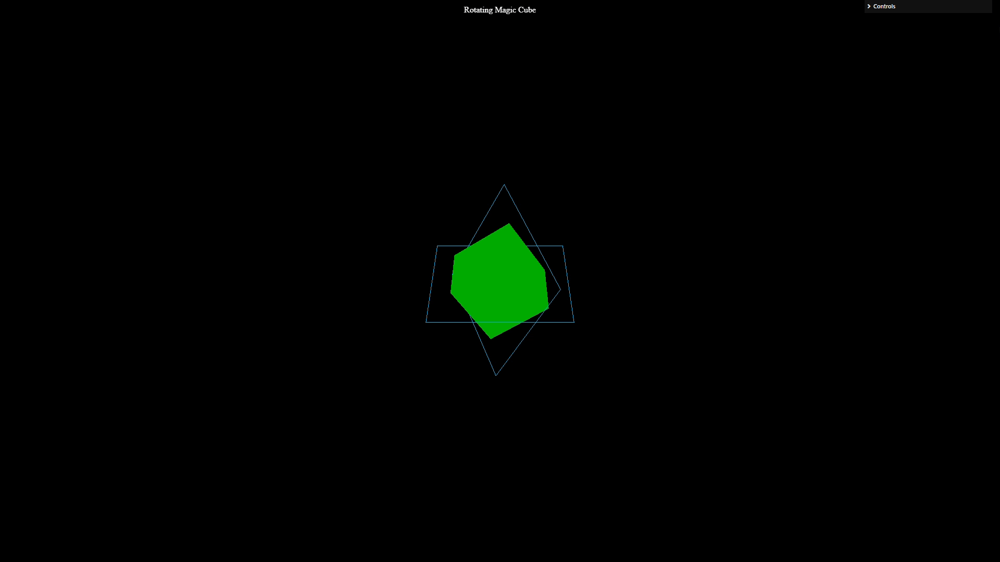

# Installation de Node.Js

Vous pouvez installer Node.Js sur votre machine grâce au lien suivant : https://nodejs.org/en/download

Nous vous laissons choisir le moyen d'installation qui vous convient le mieux et suivre les indications.

# Premiers pas avec ThreeJs

Dans cette section, vous allez apprendre les bases de ThreeJs au travers d'un exercice de découverte.

Vous allez devoir reproduire la figure suivante à l'aide de l'environnement fourni, et de [la documentation de ThreeJs](https://threejs.org/docs/)

Deux vidéos de corrections sont mises à disposition (live coding) :
- Une pour la création du cube et des 2 carrés
- Une autre pour les animations et ajouter les mouvements de caméra autour du cube.

La section 2 s'appuiera aussi sur cet exercice

